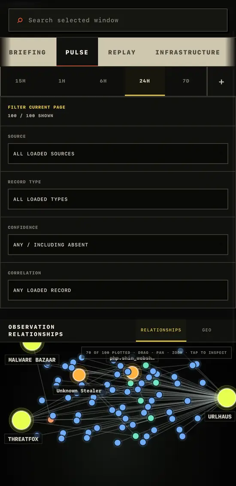
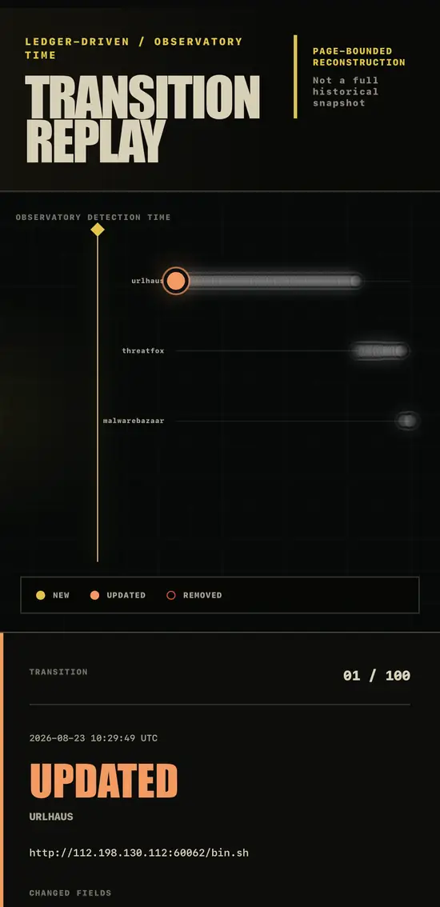

# badBANANA // THREAT OBSERVATORY 

<p align="center">
  
</p>

An evidence-first threat-observation system that keeps current source state, material-change events, and operational fetch telemetry semantically separate. Missing, stale, disabled, or unavailable data remains visibly missing. The interface never substitutes demo records or inferred attribution.

The current release hardens evidence dates and device-local acknowledgement state, makes all important read failures visibly distinct from successful zero-result states, stabilizes correlation requests, and strengthens the evidence drawer, bounded investigation filters, source interpretation, mobile controls, and export accounting. Every animated replay mark still corresponds to a retained `NEW`, `UPDATED`, or `REMOVED` event; it is not decorative network traffic.

## Production views



Pulse — cross-source relationships, source health, and current-state analysis.



Replay — page-bounded reconstruction of retained `NEW`, `UPDATED`, and `REMOVED` transitions.

Additional live surfaces include approximate public-IP infrastructure geography and first-party URLhaus / MalwareBazaar evidence views. Those surfaces are intentionally not represented by placeholder or duplicated screenshots in this README.

Production captures are source-preserving screenshots from the live v1.2.0 Observatory. They are cropped and resized/compressed for presentation; displayed evidence, timestamps, counts, IOC values, and interface states are not regenerated or substituted.

## Live deployment

- Production: https://badbanana-threat-observatory.badbanana6969.workers.dev
- Latest release: https://github.com/GnomeMan4201/badBANANA-threat-observatory/releases/tag/v1.2.0
- Frozen release source: `release/v1.2.0`

The production Worker is backed by Cloudflare D1. Feed credentials remain server-only Cloudflare Worker secrets and are never required in the browser.

## Release status

- Version: `1.2.0`
- Runtime: Node.js `22.13.0` or newer
- Deployment: Next.js on Cloudflare Workers through vinext and the Cloudflare Vite plugin
- Persistence: Cloudflare D1 with explicitly labeled isolate-memory degradation
- Production dependency audit: enforced in CI at high severity

## Ingestion mode

This deployment runs in `demand-driven` mode. The repository now targets standard Cloudflare Workers directly; scheduled triggers are intentionally not enabled in v1.2.0, so the application does not claim continuous collection. A future scheduler can call the same `runIngestionCycle()` operation after separate correctness and operational verification.

The browser makes an explicit bounded maintenance request on initial use and every five minutes while open:

```text
POST /api/ingest
        ↓
runIngestionCycle()
        ↓
configuration → TTL → backoff → D1 lease → fetch → normalize → validate
        ↓
snapshot cache + current observations + material events + cycle statistics
```

Ordinary reads are separate and local:

```text
GET /api/observations → D1 current state, scoped before pagination
GET /api/search       → D1 current state, scoped before pagination
GET /api/kev          → D1 current CISA catalog
GET /api/events       → D1 material change ledger
GET /api/geo          → local observations + bounded cached IP enrichment
```

None of those GET routes calls a source adapter. If this project later gains a genuinely supported scheduler, it can call the same `runIngestionCycle()` operation without creating a second refresh implementation.

## Source coverage

| Source | Credential | TTL | Actual coverage |
| --- | --- | --- | --- |
| CISA KEV | None | 30 minutes | Full current validated catalog |
| ThreatFox | `THREATFOX_AUTH_KEY` | 15 minutes | Requested 24-hour IOC window |
| URLhaus | `URLHAUS_AUTH_KEY` | 15 minutes | Latest 500 records returned by the recent endpoint |
| MalwareBazaar | `MALWAREBAZAAR_AUTH_KEY` | 15 minutes | Latest 100 metadata records returned by the endpoint |

Coverage is displayed per source. Bounded APIs are never presented as complete catalogs.

## Storage model

The `DB` binding owns distinct datasets:

- `threat_source_cache` and `threat_source_cache_chunks`: the latest validated per-source snapshot, stored in generation-keyed chunks.
- `observations`: latest normalized current state per stable source identity. It preserves first ingestion, latest source sighting, last material change, current hash, revision count, and latest ingest result.
- `observation_events`: meaningful `NEW`, `UPDATED`, and defensible `REMOVED` evidence events. Previous and current normalized payloads, hashes, and deterministic field diffs make prior states reconstructable.
- `source_fetch_log`: bounded fetch-attempt telemetry without response bodies or credentials.
- `source_ingest_cycles`: bounded per-refresh counts for fetched, valid, rejected, new, updated, unchanged, and removed records.
- `source_refresh_lease`: short D1-backed per-source leases preventing simultaneous isolates from duplicating upstream refreshes.
- `ingestion_runtime`: the latest overall ingestion-cycle health.
- `geo_ip_cache`: validated approximate IP geolocation results and bounded negative-cache entries. Successful results expire after 30 days; failed lookups retry after five minutes. Expired D1 rows are removed opportunistically during GEO requests, and the isolate fallback is capped at 2,000 entries.

Runtime schema definitions live in `db/schema.ts`. Initialization adds the new current-state columns to an existing observations table before creating dependent indexes.

## State and retention semantics

These questions are intentionally different:

1. **What does the source say now?** `observations` and the validated source snapshot answer this.
2. **What did badBANANA observe during this source-time window?** `/api/observations?window=...` filters current observations by upstream `observedAt`.
3. **What changed between observations?** `observation_events` and `/api/revisions` answer this.

Current state is not inaccurately described as a seven-day history table. The material event ledger is retained for seven days. Fetch and cycle telemetry is retained for two days and capped at 200 rows per source. Non-catalog current observations that have not reappeared for seven days are pruned. CISA remains current because every successful response is a full catalog; rows removed from that catalog remain available for 30 days before pruning.
Only CISA absence can currently create a `REMOVED` event because its adapter retrieves a full current catalog. Absence from bounded ThreatFox, URLhaus, or MalwareBazaar results is not treated as deletion.

An unchanged sighting advances current `lastObservedInSnapshotAt`/`lastIngestedAt` but does not create an event or increment `revisionCount`. `lastChangedAt` survives later unchanged sightings.

## CISA analyst workspace

The Exploited view separates:

- **Current KEV Catalog**: complete validated current state, independent of the dashboard time window.
- **Recent KEV**: records whose day-granular CISA `dateAdded` falls inside an explicit `TODAY`, `7D`, or `30D` range. Sub-day Observatory windows are never presented as CISA precision.

The current catalog supports server-side search, vendor, product, newly-added, ransomware association, date-added filters, and opaque cursor pagination. It displays CVE, vendor, product, vulnerability name, date added, due date, ransomware association, and required action. It does not invent CVSS scores.

## Change ledger and revisions

Content hashes cover normalized evidence fields, not Observatory bookkeeping. A changed hash produces an `UPDATED` event with the prior normalized payload, new normalized payload, prior/new hashes, and a deterministic diff over:

- title
- malware family
- threat type
- confidence
- source first/last seen
- tags
- reference
- normalized metadata keys

The provenance drawer queries `/api/revisions?id=...` and exposes current hash, last material change, revision count, retained events, and field-level diffs. Volatile ingestion timestamps do not appear in content diffs.

The drawer also exposes a versioned evidence trace for every accepted record: accepted normalized fields, optional fields that remained absent, display-only transforms, the classification basis, and the stable identity basis. This trace describes retained evidence only. Rejected upstream values are not retained and are never assigned synthetic Observatory identities. Rejections are represented separately as per-cycle aggregate counts with bounded field and reason codes; old cycles collected before that schema are labeled as lacking a breakdown rather than reconstructed.

Recent Events shows material changes only. It does not emit hundreds of unchanged `SEEN` rows after a full CISA refresh. Those sightings are summarized in source-cycle statistics.

## Device-local briefing

The default Briefing view compares the retained material-event ledger with a versioned acknowledgement cursor stored only in the current browser. First use and cleared storage are labeled as an initial baseline rather than new activity. If a saved cursor predates the retained ledger, the interface states that a complete delta cannot be proven.

Acknowledgement never mutates or deletes server events. The cursor can be exported and imported as JSON for deliberate device transfer; it is not presented as an account-synced state and the generated device identifier is never sent to the server.

Briefing totals describe the currently returned ledger page and are labeled as shown/page-bounded. They are not presented as totals for the complete retained ledger.

Imported acknowledgement timestamps are strictly validated and canonicalized to UTC ISO-8601 before storage or comparison. Browser storage is treated as optional: blocked or failing local storage produces a compact inline error and never crashes Briefing.

## Policy-bound exports

The Export workbench formats the already-loaded validated visible page as CSV, JSONL, STIX 2.1, defanged text, or an evidence manifest containing the applied policy and available record hashes. Active local search and source scope carry into Export. An empty source allow-list exports zero records. STIX represents CISA CVEs as Vulnerability objects and validated file hashes—including MalwareBazaar SHA-256 values—as Indicator objects. Selected, emitted, and unsupported counts are distinct; unsupported records are disclosed in bundle metadata rather than silently dropped. Export performs no upstream collection. Missing confidence remains missing, cross-source disagreements remain separate records, and removed ledger events never enter current-state exports silently. These artifacts are evidence transports, not firewall block recommendations.

## Backoff and concurrency

Expired sources use bounded retry delays of 1, 2, 5, 15, and 30 minutes. A valid larger `Retry-After` is respected up to one hour. During backoff, a valid prior snapshot is served as stale; an empty failed source remains offline.

Before fetching, an eligible source acquires a short conditional D1 lease. Another isolate cannot replace an unexpired holder, so only one refresh proceeds. If D1 is unavailable, the system explicitly reports degraded snapshot-only mode and an isolate-memory lease; that fallback is not described as distributed.

## Pagination

Current observations, source-specific workspaces, local search, the CISA catalog, material events, and record revisions use bounded server-side cursor queries. Source and kind constraints are applied before ordering and pagination. Cursors encode the stable sort tuple, are length/character/schema validated, and fail closed with HTTP 400 when malformed. The browser never receives the complete seven-day dataset merely to paginate locally.

## Reference and IOC safety

- IOC URLs are defanged by default and never rendered as anchors.
- References must parse as HTTP or HTTPS.
- Known CISA and abuse.ch first-party source pages may be opened normally.
- Arbitrary third-party HTTP(S) references are labeled as external, display their hostname, and offer copy-only behavior.
- IPv4 octets, IPv6 structure, ports, domains, URLs, and hashes are strictly validated.
- MalwareBazaar remains metadata-only; no samples are downloaded or served.
- All upstream URLs are fixed server-side; no API proxies user-supplied destinations.

## Rate limiting

The API limiter is an in-memory fixed-window counter scoped to a Worker isolate. It is accurately reported as best-effort isolate-local protection, not a globally authoritative Cloudflare rate limit. Ordinary reads are bounded to 120 requests per minute per reported client IP; ingestion has a separate six-request-per-minute bucket and geography has a separate twelve-request-per-minute bucket. D1 writes are not added to every read merely to overstate this control.

## API

- `POST /api/ingest` — explicit demand-driven maintenance cycle; respects TTL, backoff, and D1 leases.
- `GET /api/observations?window=24h&scope=urlhaus&limit=100&cursor=...` — paginated local current-state window; validated scopes are `all`, `urlhaus`, `malwarebazaar`, and `infrastructure`.
- `GET /api/search?q=indicator&window=24h&scope=urlhaus&limit=100&cursor=...` — paginated scoped local search; zero upstream calls.
- `GET /api/kev?limit=50&q=...&vendor=...&product=...&ransomware=known&addedSince=YYYY-MM-DD&cursor=...` — full current CISA catalog.
- `GET /api/events?limit=50&cursor=...` — material event ledger.
- `GET /api/revisions?id=...&limit=50&cursor=...` — current record plus retained revisions.
- `GET /api/correlations?id=...` — dataset-level current-state exact-indicator peers.
- `GET /api/geo?window=24h` — derives candidates only from validated local public-IP observations, retrieves at most 12 uncached provider results per request, and returns cached approximate WGS84 points with provenance.
- `GET /api/status` — source, current-state, freshness, ingestion-mode, cycle, lease, and rate-limit semantics.

## Environment and deployment

Local Cloudflare development reads server-only credentials from `.dev.vars`. Copy `.dev.vars.example` to `.dev.vars` and populate only the feeds you are authorized to use:

```text
THREATFOX_AUTH_KEY=
URLHAUS_AUTH_KEY=
MALWAREBAZAAR_AUTH_KEY=
```

Production credentials must be stored as Cloudflare Worker secrets, never committed source or GitHub variables exposed to the client. The application accesses them only through the Workers runtime binding surface. They must never appear in `NEXT_PUBLIC_*`, client components, HTML, logs, fixtures, or committed files.

The repository targets standard Cloudflare Workers directly. `wrangler.jsonc` is the Worker configuration source of truth and declares a draft D1 binding named `DB`. Wrangler 4 automatically provisions that D1 resource on the first authenticated deployment and keeps the binding linked on later deploys. No account-specific D1 identifier is committed.

Development and production commands:

```bash
npm ci
npm run dev
npm run build
npm run preview
# authenticated Cloudflare session / CI only
npm run deploy
```

GitHub Actions verification runs on every pull request and push to `main`. Production deployment is deliberately manual through the `deploy production` workflow and requires repository secrets named `CLOUDFLARE_API_TOKEN` and `CLOUDFLARE_ACCOUNT_ID`. This prevents an unreviewed branch or an incomplete credential setup from publishing automatically.

## Verification

```bash
npm ci
npm audit --omit=dev --audit-level=high
npm audit --audit-level=high
npm test
npm run lint
```

`npm test` is the supported test entry point: it performs a full production build before the deterministic suite so artifact-level client secret isolation can inspect `dist/client`. Running `node --test` directly against a clean checkout intentionally omits that required build artifact. Tests cover strict calendar and acknowledgement timestamp parsing, optional device storage, stable correlation dependencies, normalized evidence, canonical tag hashing, material event creation, unchanged re-ingestion, previous payload preservation, last-change durability, field diffs, event retention and ledger gaps, evidence traces, empty-source export policy, STIX representation/count integrity, TTL/backoff eligibility, refresh leases, server-side scope-before-pagination wiring, dedicated GEO/Recent-KEV queries, cursor validation, read-path isolation, source coverage, external reference policy, rate-limit accuracy, source failure isolation, and client secret isolation.
## Geographic enrichment

GEO mode plots only validated public IPv4/IPv6 observations. A dedicated D1 query selects eligible IP records across the requested current-state window instead of reusing the generic observations page. The response reports candidate-record totals and whether its 2,000-record safety bound was reached. Callers cannot supply arbitrary upstream destinations or IP lists. GeoJS is the fixed primary provider and FreeIPAPI is the fixed fallback; arbitrary upstream URLs are impossible. The application bounds external work through a 12-address request cap, 30-day D1 success cache, five-minute retry cache, and a dedicated route limiter. Every plotted point retains its actual provider provenance and can open its underlying local record.

## License

Released under the MIT License. See `LICENSE`.

Selecting GEO mode causes the server to send each validated public-IP candidate, together with ordinary HTTPS request metadata, to GeoJS and then FreeIPAPI when fallback is required. Those providers can therefore observe which public addresses are queried. Private, reserved, documentation, and client-supplied addresses are never sent; relationship mode performs no geolocation requests.

The Replay workspace reconstructs the current page of material ledger transitions in Observatory detection-time order. NEW, UPDATED, and REMOVED motion is driven exclusively by stored events. It is explicitly page-bounded and does not claim to reconstruct a complete historical snapshot or network traffic volume.

The Natural Earth-derived `world-atlas` package supplies the local basemap. The map clusters colocated IPs, supports hover details and click-through to provenance, and reports geolocated, excluded, unavailable, and pending counts. Private, reserved, documentation, multicast, and otherwise non-public ranges are excluded before any provider call.

IP geolocation is explicitly presented as approximate infrastructure location. It is not an actor location, event origin, nationality, ownership finding, or attribution claim. Failed enrichment stays absent; the application never generates substitute coordinates.

The default visualization remains an interactive force-directed field of individual observations linked to their source and explicitly supplied malware family. The canvas supports node dragging, field panning, zoom, animated link traffic, and direct provenance inspection. GEO is a separate evidence surface with its own provenance and failure semantics.
